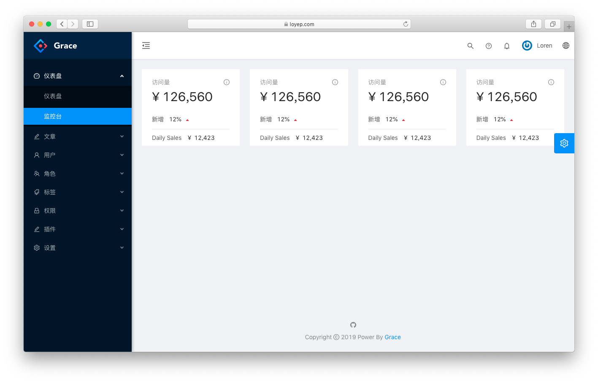

# Prism

[](https://travis-ci.org/loyep/prism)
[](https://github.styleci.io/repos/175727773)
[](https://packagist.org/packages/loyep/prism)
[](https://packagist.org/packages/loyep/prism)
[](https://packagist.org/packages/loyep/prism)
[](https://packagist.org/packages/loyep/prism)

> A Laravel-Vue Website.



## Features

- Laravel 5.8 
- Vue + VueRouter + Vuex + VueI18n + ESlint
- Pages with dynamic import and custom layouts
- Login, register and password reset
- Socialite integration

## Installation

- `composer create-project --prefer-dist loyep/prism blog`
- Edit `.env` and set your database connection details
- (When installed via git clone or download, run `php artisan key:generate` and `php artisan prism:install`)
- `php artisan migrate --seed`
- `npm install`

## Usage

#### Development

```bash
# watch
// 前端
npm run watch
// 后台
npm run watch:prism

# dev
// 前端
npm run dev
// 后台
npm run dev:prism

```

#### Production

```bash
// 前端
npm run prod

// 后台
npm run prod:prism

```

## Changelog

Please see [CHANGELOG](CHANGELOG.md) for more information what has changed recently.


## License

Prism is released under an MIT license. See [License](LICENSE) for more information.
